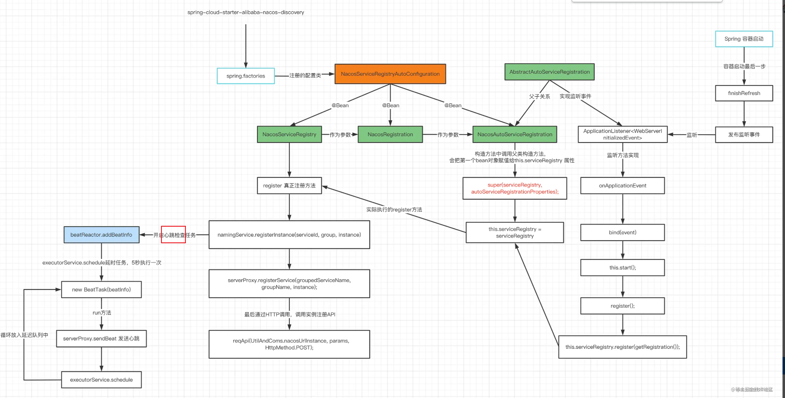

# Spring

## Sentinel

https://www.macrozheng.com/cloud/sentinel.html

### vs hystrix

https://zhuanlan.zhihu.com/p/112539441

## Nacos 服务发现/配置中心

* **客户端项目启动，是怎么自动发起服务注册？**

  1. spring读取nacos提供的`spring.factories`文件，创建其中的配置类`NacosServiceRegistryAutoConfiguration`
  2. 配置类会注册两个Bean，其中一个Bean——`NacosServiceRegistry`，其`register`方法包含实际注册的代码逻辑。另一个 Bean——`NacosAutoServiceRegistration` 会依赖`NacosServiceRegistry`
  3. 利用 **`Spring`** **`事件监听`** ，在监听的方法中`onApplicationEvent`最终会调用的 `register` 方法，从而完成自动注册。

  

  

## Zuul vs Spring Cloud Gateway

// todo

## Netty

// todo

## Loadbalancer 负载均衡

// todo

## Spring Boot Admin 监控

// todo

## Feign VS Retrofit

// todo

## 杂项

* application.yml与bootstrap.yml的区别

  **Spring Cloud会创建一个`Bootstrap Context`，作为Spring应用的`Application Context`的父上下文**。**初始化的时候，`Bootstrap Context`负责从外部源加载配置属性并解析配置。**这两个上下文共享一个从外部获取的`Environment`。`Bootstrap`属性有高优先级，默认情况下，它们不会被本地配置覆盖。

### 各种注解

* @FeignClient：自动注入rpc client。

# Java

* @Nullable：表示对象可以为null，用于文档生成等，没有实际逻辑。