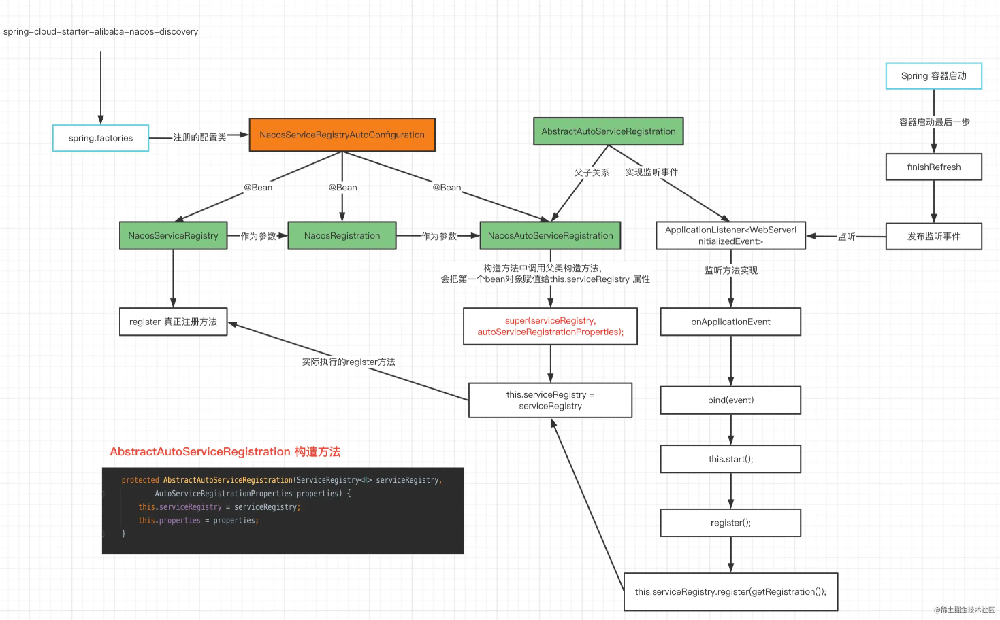

# Nacos

https://juejin.cn/book/7180604185786712075/section/7181705133464977468

## 服务发现

### 服务注册

* **客户端怎么进行服务注册的？**

  1. spring读取nacos提供的`spring.factories`文件，创建其中的配置类`NacosServiceRegistryAutoConfiguration`
  2. 配置类会注册两个Bean，其中一个Bean——`NacosServiceRegistry`，其`register`方法包含实际注册的代码逻辑。另一个 Bean——`NacosAutoServiceRegistration` 会依赖`NacosServiceRegistry`
  3. 利用 **Spring 事件监听**(`ApplicationListener.onApplicationEvent`) ，在监听方法中最终会调用的 `register` 方法，从而完成自动注册。
  4. 在 register 方法会发送http请求给nacos服务端，完成服务注册。

  

  

* 客户端下线取消注册：`AbstractAutoServiceRegistration` 类有一个 `@PreDestroy`注解修饰的`destroy()` 方法。在 Spring 容器销毁时，会调用它，内部会请求nacos的取消注册接口。

* 客户端定时发送心跳，服务端接收到了`实例心跳`接口的请求，它会通过 ip + port 找到对应的 Instance，在 Instane 对象中有个属性叫作：lastBeat，最后会把这个属性修改成当前最新的时间，`实例心跳`接口就结束了。
* 服务端后台异步定时检查：如果 lastBeat 超过当前时间 15s，表示实例状态不健康；如果超过 30s，Nacos 则会自动把该实例进行删除。
* 客户端定时从服务端拉取实例列表，缓存在本地。
* 客户端下线后：服务端将实例从本地移除，并通过`udp`协议通知客户端。UDP 不可靠，但客户端会定时拉，做兜底。（2.x版本改用rpc通知）

### 集群逻辑

* nacos服务端节点会定时检查彼此状态（发送请求给对方，无响应表示不健康）
* 客户端注册到某个nacos节点后，nacos会异步通知其他节点。
* 新的nacos节点会请求其他nacos节点来获取已有的实例数据。
* @CanDistro：如果当前处理心跳请求的集群节点，不是这个 service 的责任节点，那么这个过滤器就会转发到对应的责任节点上做处理。心跳请求处理、服务健康状态都是同一个责任节点来做，所以 lastBeat 不需要在集群节点中同步。

## 配置中心

* 在spring容器初始化时从nacos服务端拿到配置放到容器中（NacosPropertySourceLocator）
* 服务端在配置变更时通知客户端，客户端会去刷新容器中的最新配置文件数据，最后再把被 `@RefreshScope` 注解修饰的类进行销毁，销毁之后在容器下一次使用这个 Bean 的时候会发现没有了，就会重新去创建这个 Bean 对象，在创建的时候，就会使用最新的配置文件内容。

* 节点之间同步数据：
  1. 某一节点接收到配置后更新到数据库（比如MySQL）
  2. 发送请求给其他节点
  3. 其他节点收到请求后从数据库拉配置，然后持久化到本地磁盘。
  4. 客户端启动时会长轮询nacos，配置变更时通过长轮询给客户端最新配置。