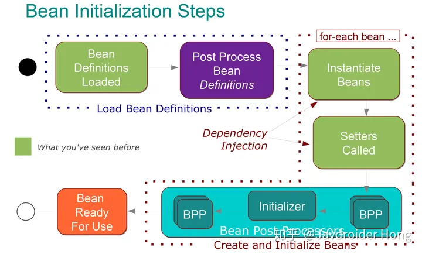

# 面筋

https://github.com/Snailclimb/JavaGuide/blob/main/docs/system-design/framework/spring/spring-knowledge-and-questions-summary.md

# 控制反转（ Inverse of Control , IOC ）

IOC：不直接控制import那个具体类，而是把控制权交给容器，由容器决定import哪个组件。

https://mp.weixin.qq.com/s?__biz=Mzg2OTA0Njk0OA==&mid=2247486938&idx=1&sn=c99ef0233f39a5ffc1b98c81e02dfcd4

https://javadoop.com/post/spring-ioc

## BeanFactory

BeanFactory 是生产和管理 Bean的实例。

### Bean

* Bean 可以理解为 BeanDefinition 实例。我们自己定义的各个 Bean 其实会转换成一个个 BeanDefinition 存在于 Spring 的 BeanFactory 中。BeanDefinition 中保存了我们的 Bean 信息，比如这个 Bean 指向的是哪个类、是否是单例的、是否懒加载、这个 Bean 依赖了哪些 Bean 等等。

## ApplicationContext

* ApplicationContext 继承自 BeanFactory，但是它不应该被理解为 BeanFactory 的实现类，而是说其内部持有一个实例化的 BeanFactory（DefaultListableBeanFactory）。以后所有的 BeanFactory 相关的操作其实是委托给这个实例来处理的。

  ApplicationContext 既继承了BeanFactory，也组合了BeanFactory
  
* ContextRefreshedEvent 事件发生在容器初始化完毕后。此时 Spring 已经将所有的 bean 被成功加载，我们可以在这个监听器中注入我们要用到的 bean

# 面向切面编程（Aspect-Oriented Programming，AOP）

## 原理

参见 BeanPostProcessor 接口。

## 动态代理

* JDK Proxy：需要目标类实现某个接口
* CGLib Proxy：不要求实现接口，以生成子类的方式去代理

## 事务

@Transactional 注解利用了 AOP 思想，动态生成代理类，实现事务逻辑。

### 事务传播

* **`PROPAGATION_REQUIRED`**：默认传播行为，也是使用的最多的一个事务传播行为。如果当前存在事务，则加入该事务；如果当前没有事务，则创建一个新的事务。
* **`PROPAGATION_REQUIRES_NEW`**和**`PROPAGATION_NESTED`**的区别：外部事务抛出异常时，PROPAGATION_REQUIRES_NEW 不影响内部事务的提交，而 Nested 会。https://blog.csdn.net/aiyaya_66da/article/details/94171771

# Bean生命周期

* new
* BeanPostProcessor.postProcessBeforeInitialization
* InitializingBean.afterPropertiesSet
* BeanPostProcessor.postProcessAfterInitialization

## BeanPostProcessor

https://www.jianshu.com/p/1417eefd2ab1

