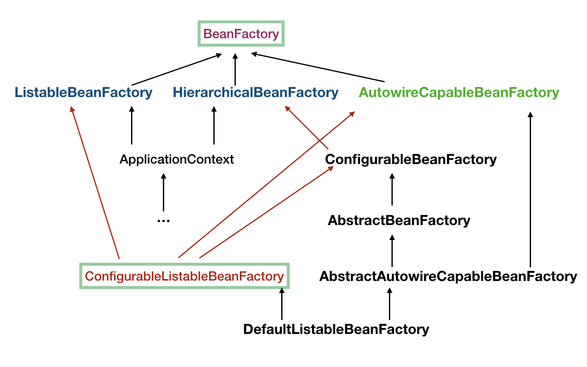

# 控制反转（ Inverse of Control , IOC ）

IOC：不直接控制import那个具体类，而是把控制权交给容器，由容器决定import哪个组件。

https://javadoop.com/post/spring-ioc

## BeanFactory

BeanFactory 是生产和管理 Bean的实例。

### Bean

* Bean 可以理解为 BeanDefinition 实例。我们自己定义的各个 Bean 其实会转换成一个个 BeanDefinition 存在于 Spring 的 BeanFactory 中。BeanDefinition 中保存了我们的 Bean 信息，比如这个 Bean 指向的是哪个类、是否是单例的、是否懒加载、这个 Bean 依赖了哪些 Bean 等等。

## ApplicationContext

* ApplicationContext 继承自 BeanFactory，但是它不应该被理解为 BeanFactory 的实现类，而是说其内部持有一个实例化的 BeanFactory（DefaultListableBeanFactory）。以后所有的 BeanFactory 相关的操作其实是委托给这个实例来处理的。

  ApplicationContext 既继承了BeanFactory，也组合了BeanFactory